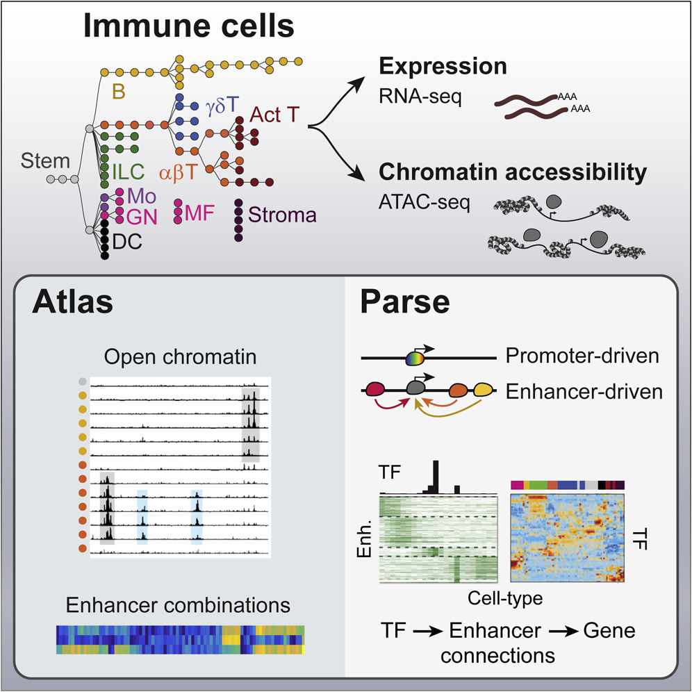

# Topic 2: Determine Gene regulation of Immune cells from paired ATAC- And RNA-seq data

### Project overview and guidelines

-   [Introduction](#introduction)
-   [Objective](#objectives-and-work-plan)
-   [Description of datasets](#description-of-datasets)
-   [Literature review](#literature-review)
-   [How to structure your project](#how-to-structure-your-project)
    -   [Project proposal](#project-proposal)
    -   [Project](#project)

### Supervisor

- Dr. Alexander Sasse <a.sasse@zmbh.uni-heidelberg.de>
- Tutorin: Aidana Smugalova	<aidana.smagulova@stud.uni-heidelberg.de>

## Introduction

Differential gene expression enables multi-cellular organisms to derive distinct cell types and tissues from the same genome. Gene expression is controlled by multiple transcriptional and post-transcriptional regulatory processes that employ thousands of regulatory factors, forming complex but robust gene-regulatory networks (GRNs) across time and space [(Ramirez et al 2017)](#1). At the transcriptional level, cis-regulatory elements (CREs) represent genomic regions that can be bound by regulatory factors to control nearby or distal sets of genes. In promoter sequences, roughly defined as the regions around the transcription start sites (TSS) of genes, transcription factors (TFs) recognize and bind specific sequence patterns (aka motifs) in the DNA to remodel chromatin and drive initiation of complexes around RNA polymerase II (Pol-II). Moreover, higher eukaryotic organisms utilize addititional distal CREs, called enhancers, which are located further upstream or downstream of the TSS, often in intronic regions or even further away. Enhancers interact with promoters and facilitate transcription initiation or control promoter activity. The differential interplay between multiple CREs creates complex transcriptional dynamics and patterns that are necessary for proper development and cell differentiation.

RNA sequencing (RNA-seq) revolutionized transcriptomics by allowing the unbiased, high-throughput quantification of gene expression across the entire transcriptome. It has been widely applied in cell differentiation studies, disease research, and functional genomics to identify key regulators of cellular identity and function. Despite the power of RNA-seq in measuring gene expression, it does not provide direct insights into the upstream regulatory mechanisms controlling transcription. Chromatin accessibility plays a crucial role in determining which genes are actively transcribed. Early techniques such as DNase-seq and ChIP-seq provided valuable information on chromatin states and transcription factor binding but were often limited by high cell input requirements and labor-intensive protocols. The development of ATAC-seq (Assay for Transposase-Accessible Chromatin using sequencing) in 2013 provided a more efficient and scalable method for profiling chromatin accessibility [(Buenrostro et al. 2013](#2), [2015)](#3).

ATAC-seq leverages a hyperactive Tn5 transposase, which preferentially inserts sequencing adapters into regions of open chromatin. This allows researchers to identify regulatory regions actively engaged in transcriptional control, such as promoters, and enhancers. Compared to DNase-seq, ATAC-seq requires fewer cells, has a simpler protocol, and provides high-resolution insights into chromatin accessibility, making it an invaluable tool for studying gene regulation. Additionally, ATAC-seq enables the inference of nucleosome positioning and TF binding dynamics, allowing researchers to map regulatory landscapes with high precision [(Hu et al. 2025)](#4).

By integrating ATAC-seq with RNA-seq, researchers can link changes in chromatin accessibility to transcriptional outputs, providing a mechanistic understanding of gene regulation [(Yan et al. 2020)](#5). This combined approach has been used in a variety of studies, including cancer research to identify tumor-specific regulatory elements [(Corces et al. 2018)](#6), developmental biology to map lineage-specific enhancers [(Cusanovich et al., 2018)](#7), and immunology to study immune cell activation and differentiation [(Yoshida et al. 2019](#8), [Calderon 2019 et al.)](#9). By jointly analyzing open chromatin regions and gene expression profiles, scientists can reconstruct regulatory networks that define cell states and transitions.

 <b>Fig. 1.</b> Analyzing the Interplay of Cis-regulatory Elements during Mouse Immune Cell Differentiation (Yoshida et al. 2019) 

## Objectives and work plan

In this project, we aim to investigate the transcriptional regulatory landscape of immune cells using paired ATAC-seq and RNA-seq measurements of 90 immune cell types. We seek to classify different regulatory mechanisms that control gene expression and understand how CREs control transcriptional changes during differentiation More specifically, we are interested in:

- How do cis-regulatory landscapes vary between lineage-related cell types to promote cellular identity? 
- How do changes in the activity of cis-regulatory elements program the differentiation cascade of cell lineages?

To answer these broad questions we will perform various analyses below and adress more specific questions with the provided data. Individual groups will focus on specific cell lineages in more depth: 

- **Group 1**: B cells  
- **Group 2**: abT & T.act cells  
- **Group 3**: abT & gdT cells  
- **Group 4**: ILC cells  

1) Determine differences and similarities of the chromatin landscape between immune cells:
	1) How variable is the chromatin signal within cells?
		1) Is the signal (median, mean, std) dependent on the sequencing depth, number of input cells, or another QC metric? 
		2) Should some cell types be removed from downstream analysis, or should we apply additional normalization?
	2) How variable is the chromatin signal for CREs across cells?
		1) Should some peaks be removed for downstream analysis due to lack of signal?
		2) Do promoters exibit specific signals that make them differ from enhancers? 
		3) Is there a relationship between the signal and the distance to the TSS?
		4) Are intronic enhancers different from enhancers outside the transcript.
	3) Do related cell types cluster together based on their ATAC signal?
		1) Does the clustering reproduce known relationship between cells? 
		2) Can one quantify the similarity of cell types in a sorted matrix?
	4) Can one define different classes of peaks based on the signal and the signal variation across cells?
		1) Can one cluster CREs based on their ATAC-signal?
		2) Can one visualize the behaviour of clustered regions?
		3) Can one define cell lineage specific CRE clusters?
		4) Are there differences between these cell-lineage specific CRE clusters? When and how long are they active?

2) Determine the relationship between the chromatin landscape and gene expression: 
	1) Does clustering of the gene expression matrix show the same relationships between cell types as the ATAC-seq data?
	2) Can one cluster genes based on their expression profiles?
		1) Can your determine a specific set of genes for your cell lineage? 
		2) Are there subclusters of special interest?
	3) Can one use correlation analysis and distance information to associate ATAC-seq regions with gene expression?
		1) Where are associated CREs located with respect to the TSS?
		2) Where are the most associated CREs located?
		3) How many CREs are associated with genes?
		4) Is every promoter associated with a gene?
		5) Are some promoters associated with other genes?
		6) What is the closest associated CRE to a gene?
		7) Are there CREs that control several genes?
	4) Can one use regression to associate CREs with gene expression? 
		1) How much of the variance of gene expression can be explained for each gene with this approach?
		2) How do the coefficients differ when it is performed on your cell lineage alone?
		3) Which CREs control your cell lineage specific genes?
		4) How do the results of this analysis differ from pure association via correlation?
		5) Are there differences between activating and repressing CREs? 
		6) How many genes are mainly regulated by a repressing CREs, and can promoters act through repression? 
		7) Where are repressing CREs located compared to activating CREs? 
		8) Are there CREs that are repressing for one gene but activating for another gene?
		9) Does CRE clustering change if one includes the effect direction on gene expression?
		

3) **(voluntary) Can one combine information about TF motif matches, changes in ATAC-signal, and changes in gene expression for the corresponding TF to associate TFs with the regulation of individual ATAC peaks, peak clusters, and genes?
	1) Which TFs are most important for your cell lineage?

## Description of datasets

The data can be visualized in the UCSC genome browser, the link to these data can be found here: http://rstats.immgen.org/Chromatin/chromatin.html.

You can download the datasets for the analysis from here:

- [Processed ATAC-seq data and called peaks](https://sharehost.hms.harvard.edu/immgen/ImmGenATAC18_AllOCRsInfo.csv)
- [Processed RNA-seq data](https://www.cell.com/cms/10.1016/j.cell.2018.12.036/attachment/4392da81-c56e-471a-b1df-0e72f03ecd77/mmc2.csv)
- [Summary of Immune Cell Populations Profiled by ATAC-Seq and Their QC Matrices](https://www.cell.com/cms/10.1016/j.cell.2018.12.036/attachment/e5df7329-d77d-40b3-a03a-34bdbe4b402c/mmc1.xlsx)
- [Transcript, Coding, and Exon Start and End Positions](http://hgdownload.cse.ucsc.edu/goldenPath/mm10/database/refFlat.txt.gz)
	+ The columns in this file are: Gene Name , Transcript Name, Chromosome, Strand, 5' transcript Start, 3' Transcript Start, Coding Region 5' Start, Coding Region 3' Start, Exon Count, Exon Starts, Exon Ends
	+ Use Strand information to determine TSS
- [Chromvar TF motif associations for all OCRs (*only for voluntary task)](https://sharehost.hms.harvard.edu/immgen/ImmGenATAC18_AllTFmotifsInOCRs.txt)

## Literature review

- **Ramirez et al., 2017**:  
  Ramirez, R. N., El-Ali, N. C., Mager, M. A., Wyman, D., Conesa, A., & Mortazavi, A. (2017). Dynamic Gene Regulatory Networks of Human Myeloid Differentiation. *Cell Systems, 4*(4), 416-429.e3. [https://doi.org/10.1016/j.cels.2017.03.005](https://doi.org/10.1016/j.cels.2017.03.005) <a id="1">[1]</a>

- **Buenrostro et al., 2013**:  
  Buenrostro, J. D., Giresi, P. G., Zaba, L. C., Chang, H. Y., & Greenleaf, W. J. (2013). Transposition of native chromatin for fast and sensitive epigenomic profiling of open chromatin, DNA-binding proteins and nucleosome position. *Nature Methods, 10*(12), 1213–1218. [https://doi.org/10.1038/nmeth.2688](https://doi.org/10.1038/nmeth.2688) <a id="2">[2]</a>

- **Buenrostro et al., 2015**:  
  Buenrostro, J. D., Wu, B., Chang, H. Y., & Greenleaf, W. J. (2015). ATAC-seq: A Method for Assaying Chromatin Accessibility Genome-Wide. *Current Protocols in Molecular Biology, 109*, 21.29.1–21.29.9. [https://doi.org/10.1002/0471142727.mb2129s109](https://doi.org/10.1002/0471142727.mb2129s109) <a id="3">[3]</a>

- **Hu et al., 2025**:  
  Hu, Y., Horlbeck, M. A., Zhang, R., et al. (2025). Multiscale footprints reveal the organization of cis-regulatory elements. *Nature, 638*, 779–786. [https://doi.org/10.1038/s41586-024-08443-4](https://doi.org/10.1038/s41586-024-08443-4) <a id="4">[4]</a>

- **Yan et al., 2020**:  
  Yan, F., Powell, D. R., Curtis, D. J., & Wong, N. C. (2020). From reads to insight: a hitchhiker’s guide to ATAC-seq data analysis. *Genome Biology, 21*, 22. [https://doi.org/10.1186/s13059-020-1929-3](https://doi.org/10.1186/s13059-020-1929-3) <a id="5">[5]</a>

- **Corces et al., 2018**:  
  Corces, M. R., et al. (2018). The chromatin accessibility landscape of primary human cancers. *Science, 362*(6413), eaav1898. [https://doi.org/10.1126/science.aav1898](https://doi.org/10.1126/science.aav1898) <a id="6">[6]</a>

- **Cusanovich et al., 2018**:  
  Cusanovich, D. A., et al. (2018). The cis-regulatory dynamics of embryonic development at single-cell resolution. *Nature, 555*(7697), 538–542. [https://doi.org/10.1038/nature25981](https://doi.org/10.1038/nature25981) <a id="7">[7]</a>

- **Yoshida et al., 2019**:  
  Yoshida, H., et al. (2019). The cis-Regulatory Atlas of the Mouse Immune System. *Cell, 176*(4), 897–912.e20. [https://doi.org/10.1016/j.cell.2018.12.036](https://doi.org/10.1016/j.cell.2018.12.036) <a id="8">[8]</a>

- **Calderon et al., 2019**:  
  Calderon, D., et al. (2019). Landscape of stimulation-responsive chromatin across diverse human immune cells. *Nature Genetics, 51*(10), 1494–1505. [https://doi.org/10.1038/s41588-019-0518-2](https://doi.org/10.1038/s41588-019-0518-2) <a id="9">[9]</a>

## How to structure your project

### Project proposal

Your first task will we to define a **project proposal**, which should include

-   summary of literature on this dataset
-   questions you want to address
-   approximate timetable

You will present this project proposal together with a literature review on the subject 3 week after the beginning of the semester (10 minute presentation + 5 minutes discussion).

### Project

Your project **MUST** contain the following elements:

- **descriptive statistics** about the datasets

- **graphical representations**

- **dimension reduction** analysis (PCA, clustering or k-means)

- **statistical tests** (t-test, proportion tests etc)

- **linear regression** analysis, either uni- or multivariate

Note, if you follow the individual points in the work programme, you should perform at least one of each at some point. 

#### Data cleanup

You will be analyzing multiple data sets together. It is essential that you explore each dataset and clean it. Cleaning can refer to many things:

-   Removing/Imputing missing values

-   Removing low variance columns/rows

-   Removing batch effects

-   Removing outlier samples (only if it is due to technical issues !!)

-   Making sure that data is in the correct format, for example, numbers should be encoded as numeric and not as characters. Categorical variables should be factors etc.

-   Re-ordering rows/columns in meaningful and useful ways

#### Data exploration

Now that you have cleaned data, explore your data to understand its structure. Perform basic exploratory data analysis.

-   Look at the distribution of the overall data, specific samples or features.

-   Visualize the data distribution

-   Visualize the inter-dependencies (e.g. correlations) among specific samples/features of interest

-   Check some of your hypothesis like - is something high/low between two  conditions etc

#### Data reduction

You have a high dimension matrix, that is, you have way more features than observations.

-   Try out methods to reduce the dimensionality of this data.

-   Cluster your samples to identify similar and dis-similar groups

-   Check how well the groups separate based on the features of your interest

#### Data modelling

Use linear regression to evaluate the relation between variables and predicting one using others.
